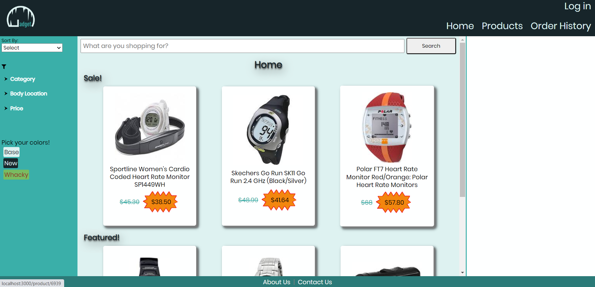
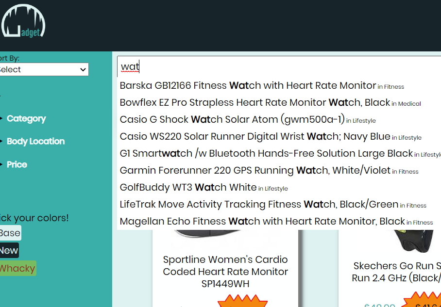
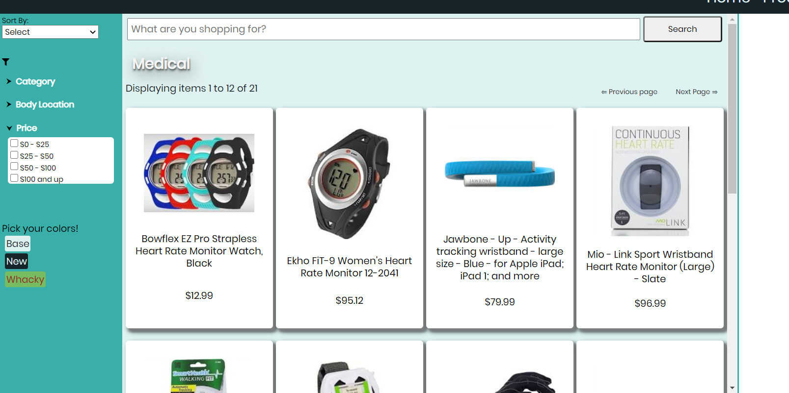
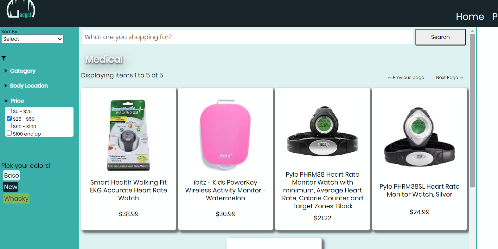
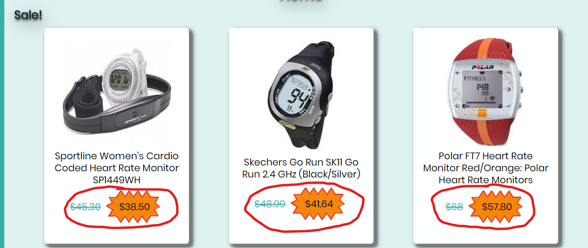
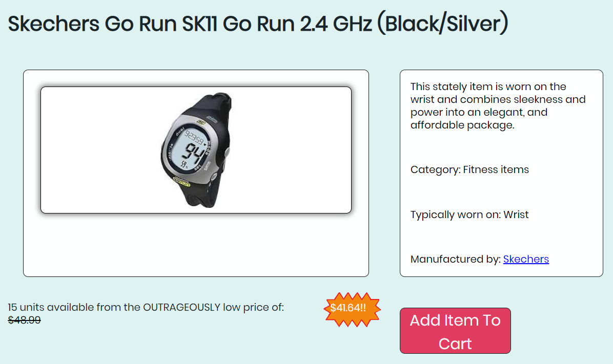
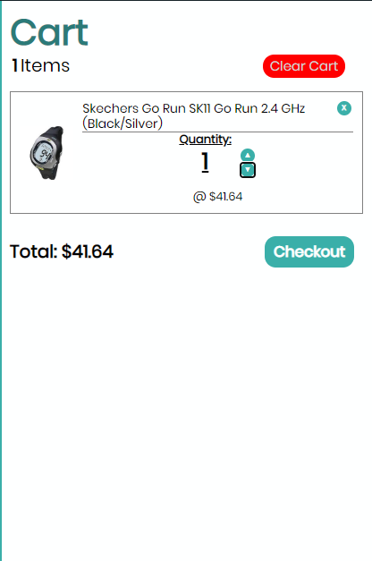
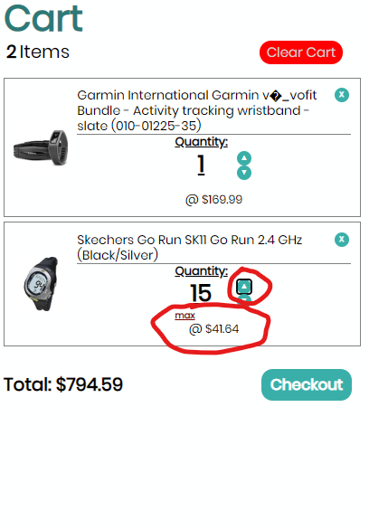
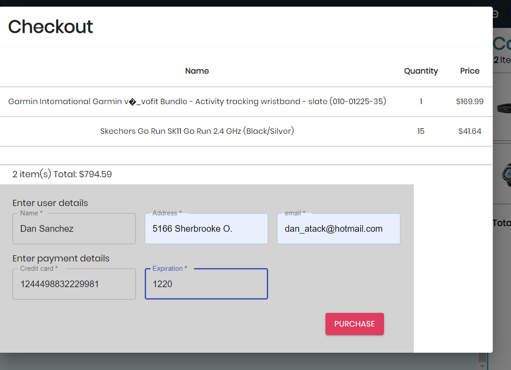
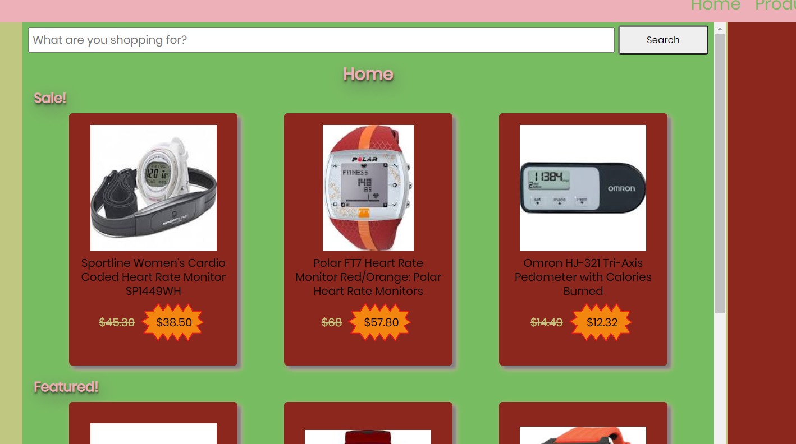

# Gadget Grotto: The E-Commerce Site Of Tomorrow

### This was a 1-week team project where my colleagues and I made an eCommerce site from scratch, using React, Redux, Node.js, Express and GitHub for version control. The project is a fully functional shopping website inspired by the style of Amazon.com and Walmart, where users can browse items by category, add items to a mock shopping cart, and checkout at the end of their session with a simulated purchase modal. Users also have the option to login with Google's Auth0 to save their account between shopping sessions.

## Features and Technologies:

1. Front-End uses React and Redux to store the customer's purchases in a Cart sidebar.

2. Customer can search for products by name (typeahead function is activated after 3 characters are entered to give suggestions).

3. Customers can search for products by category, and have several filter options to narrow their focus.

4. All product data is sent from the server in response to specific requests; server also sends the three items with the highest stock as 'sale' items upon initial load; sale items are marked with a special discount sticker and reduced price.

5. Clients can click on an item's card to bring up the item's detail page, which contains additional information on the product as well as a link to the manufacturer's page.

6. When the client clicks the 'Add to Cart' button, the selected item is placed in their shopping cart, which uses Redux to store all cart item data in state and restricts quantity adjustments based on the number of items available in stock:

7. When shopping is completed, the user can enter their (simulated) credit card information to a purchase modal, and then view an order confirmation page with a unique ID number afterwards.

8. User can select from a few different colour schemes including 'base', 'dark mode' and 'whacky' circus colours (not recommended):

### Technical Challenges Achieved:

1. Used Git and GitHub to coordinate work on a 4-person project with multiple pulls/pushes occuring per day and very few merge conflicts.

2. Used Redux for all state management of cart items, filter and category selections and quantity tracking for items in the cart.

3. Used Styled Components with adjustable colour-theme props to allow for quick changes to the user interface.

4. Used Node.js and Express to create a very streamlined server with about a dozen different endpoints each using its own sorting algorithm to deliver the appropriate product info to the Front End.
